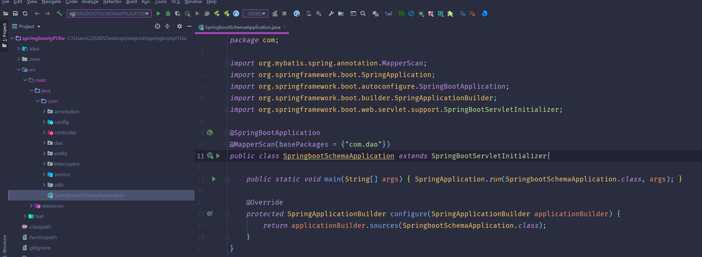

# 基于SpringBoot的网上租赁系统

<h4 style='color:red'>联系不到我，就看我的主页 </h4> 
 
#### 介绍

基于SpringBoot的网上租赁系统是一款高效便捷的在线租赁平台，旨在为用户和商家提供一个安全、灵活的租赁环境。系统分为管理端、商家端和用户端，每个角色拥有特定的功能模块，满足各自的需求和职责。

#### 技术栈

后端技术栈：Springboot+Mysql+Maven

前端技术栈：Vue+Html+Css+Javascript+ElementUI

开发工具：Idea+Vscode+Navicate

#### 系统功能介绍

管理端功能模块

个人中心：查看和编辑个人信息，包括修改密码和更新联系方式。

用户管理：管理平台用户信息，进行用户的新增、修改和删除，确保用户数据的准确性。

商家管理：管理商家信息，包括商家的注册、审核、修改和删除，确保商家资质的真实性和合规性。

商品信息管理：管理平台上的所有商品信息，包括商品的新增、修改和删除，确保商品信息的及时更新。

商品分类管理：管理商品的分类信息，便于商品的整理和查找。

订单信息管理：查看和管理所有订单信息，包括订单的处理和跟踪。

发货订单管理：管理发货订单信息，确保订单的及时发货和物流跟踪。

租赁订单管理：管理租赁订单信息，跟踪租赁过程中的各个环节，确保租赁的顺利进行。

商家端功能模块

商品信息：查看和管理商家自己的商品信息。

个人中心：查看和编辑个人信息，包括修改密码和更新联系方式。

后台管理：
商品信息管理：管理商家发布的商品信息，包括新增、修改和删除商品。

订单信息管理：查看和管理商家的所有订单信息，确保订单的及时处理。

发货订单管理：管理商家需要发货的订单，跟踪发货进度。

租借订单管理：管理商家的租借订单，跟踪租借过程。

完成订单管理：管理已经完成的订单，进行订单的归档和统计。

订单管理：综合管理商家的所有订单，确保订单处理的完整性和高效性。

购物车：管理商家的购物车，便于商品的管理和下单。

用户端功能模块

商品信息：查看平台上的所有商品信息，进行商品的浏览和筛选。

个人中心：查看和编辑个人信息，包括修改密码和更新联系方式。

后台管理：

订单信息管理：查看和管理用户的所有订单信息。

发货订单管理：跟踪用户的发货订单，确保订单的及时收货。

租借订单管理：管理用户的租借订单，跟踪租借过程。

完成订单管理：查看和管理用户已经完成的订单。

我的收藏管理：管理用户收藏的商品，便于快速访问和下单。

购物车：管理用户的购物车，进行商品的添加、删除和结算。

#### 系统作用

对管理端的作用

高效管理：提供全面的管理工具，帮助管理员高效管理用户、商家和商品，确保平台的正常运营。

信息维护：通过商品分类和信息管理，管理员可以及时更新和维护商品信息，保证信息的准确性和完整性。

订单跟踪：管理和跟踪订单信息，确保订单的及时处理和发货，提高客户满意度。

对商家端的作用

便捷管理：商家可以方便地管理自己的商品信息和订单，确保商品的及时更新和订单的高效处理。

订单跟踪：通过订单管理功能，商家可以实时跟踪订单状态，确保订单的顺利完成。

客户服务：提供高效的客户服务工具，帮助商家及时处理客户的咨询和反馈，提高客户满意度。

对用户端的作用

便捷购物：用户可以方便地浏览商品信息、管理购物车和下单，享受便捷的购物体验。

信息获取：通过商品资讯功能，用户可以及时获取最新的商品信息和推荐，了解市场动态。

订单管理：用户可以方便地管理自己的订单，跟踪订单状态和租借过程，确保交易的顺利进行。

#### 系统功能截图

代码结构

数据库表

登录

用户管理

商家管理

商品信息管理

发货订单

租赁订单管理

前端页面首页

商家端后台管理

购物车

用户端后台管理

#### 总结

基于SpringBoot的网上租赁系统通过角色分工和功能模块的设计，实现了租赁平台的高效化和便捷化。管理员可以通过系统高效管理用户、商家和商品，确保平台的正常运营；商家可以方便地管理商品和订单，提高服务质量；用户则可以方便地浏览商品、管理购物车和订单，享受便捷的购物体验。该系统不仅提升了租赁服务的效率，也为用户和商家提供了良好的互动平台。

#### 使用说明

创建数据库，执行数据库脚本 修改jdbc数据库连接参数 下载安装maven依赖jar 启动idea中的springboot项目

后台地址：http://localhost:8080/springbootyf10w/admin/dist/index.html

管理员  abo 密码 abo

前台地址：http://localhost:8080/springbootyf10w/front/index.html

